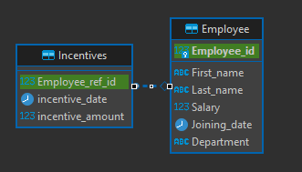
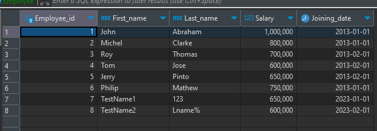
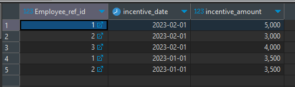

karena tidak diperbolehkan menggunakan akses internet sehingga tidak bisa menginstal package jadi disini saya memutuskan untuk membuatnya melalui query

***membuat table***
CREATE TABLE "Employee" (
   "Employee_id" INT GENERATED ALWAYS AS IDENTITY,
   "First_name" VARCHAR(255) NOT NULL,
   "Last_name" VARCHAR(255) NOT NULL,
   "Salary" INTEGER NOT NULL,
   "Joining_date" Date NOT NULL,
   "Department" VARCHAR(255) NOT NULL,
   PRIMARY KEY("Employee_id")
);

CREATE TABLE "Incentives"(
"Employee_ref_id" int,
"incentive_date" Date,
"incentive_amount" int,
   CONSTRAINT "Employee_ref_id"
      FOREIGN KEY("Employee_ref_id") 
	  REFERENCES "Employee"("Employee_id")
);

**seeding data**
insert into "Employee"("First_name" , "Last_name" , "Salary" , "Joining_date" , "Department")
values ('John', 'Abraham', 1000000, '01-01-2013', 'Banking'),
('Michel', 'Clarke', 800000, '01-01-2013', 'Insurance'),
('Roy', 'Thomas', 700000, '01-02-2013', 'Banking'),
('Tom', 'Jose', 600000, '01-02-2013', 'Insurance'),
('Jerry', 'Pinto', 650000, '01-02-2013', 'Insurance'),
('Philip', 'Mathew', 750000, '01-01-2013', 'Sercives'),
('TestName1', '123', 650000, '01-01-2013', 'Services'),
('TestName2', 'Lname%', 600000, '01-02-2013', 'Insurance')
;

insert into "Incentives"("Employee_ref_id" , "incentive_date" , "incentive_amount")
values (1 , '01-02-2023' , 5000),
(2 , '01-02-2023' , 3000),
(3 , '01-02-2023' , 4000),
(1 , '01-01-2023' , 3500),
(2 , '01-01-2023' , 3500)
;

***soal1**
select e."First_name" , e."Last_name"  from "Employee" e 
where e."Salary" < 750000 and e."Department" != 'Services'
order by e."Salary" desc
;

**soal2**
select e."First_name", e."Last_name",(e."Salary" + i."incentive_amount") as "Total Gaji"  from "Employee" e 
	join "Incentives" i ON i."Employee_ref_id" = e."Employee_id"
	order by (e."Salary" + i."incentive_amount") desc;

**soal3**
select e."First_name", e."Last_name",(e."Salary" + i."incentive_amount") as "Total Gaji"  from "Employee" e 
	left join "Incentives" i ON i."Employee_ref_id" = e."Employee_id"
	order by (e."Salary" + i."incentive_amount") desc;

**soal4**
select e."First_name" , e."Last_name", "Department" from "Employee" e 
where e."Joining_date" = '01-01-2013'
;

**soal5**
select e."Department" , count(e."Department") from "Employee" e 
group by e."Department" 
;

pada table employee memiliki kolom employee_id sebagai unique identifier untuk karyawan tersebut, nama sebagai penanda nama karyawan tersebut, gaji sebagai menentukan brapa gaji karyawan tersebut, joining_date sebagai penanda kapan karyawan tersebut masuk ke dalam perusahaan, dan departement sebagai penanda karyawan tersebut masuk di depaterment yang mana

pada table incentive terdapat kolom employee_ref_id yang mereferensikan ke karyawan yang mana insentif tersebut, incentive_date untuk menunjukkan kapan incentive tersebut diberikan, dan incentive amount untuk menunjukkan seberapa besar jumlah insentif yang diberikan